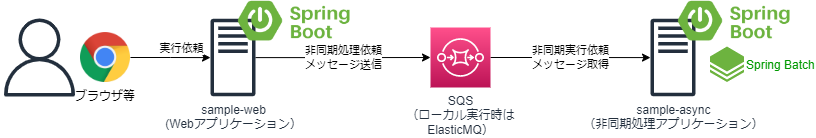

# springboot-jms-sqs
## 本サンプルプログラムについて
* Spring BootでSpring JMS + AWS SQS Messaging Libraryをつかって、非同期実行依頼を実施するサンプルAPです。
* 開発端末ローカル実行時にAWS SQSがなくても動作するよう、AP起動時にSQSの代わりに、SQS互換のFakeとしてElasticMQを組み込みで起動して動作しますので、特にAWS環境がなくても単独実行可能です。

## プロジェクト構成
* sample-web
    * Spring BootのWebアプリケーションで、APIから、非同期実行依頼が可能です。
        * デフォルトでは「spring.profiles.active」プロパティが「dev」になっていて、プロファイルdevの場合は、AP起動時にSQSの代わりにElasticMQを組み込みで同時に起動するようになっています。
* sample-async
    * Spring JMSを使ったSpring Bootの非同期処理アプリケーションで、sample-webが送信した非同期実行依頼のメッセージをSQSを介して受信し処理することが可能です。
        * デフォルトでは「spring.profiles.active」プロパティが「dev」になっていて、sample-webのAP起動時に、同時に起動されるElasticMQをリッスンするようになっています。

## 動作手順
1. Web AP（sample-web）の起動
    * sample-webをSpringBoot Applicationとして起動します。    

1. 非同期AP（sample-async）の起動
    * sample-asyncをSpringBoot Applicationとして起動します。
    * デフォルト（「spring.profiles.active=dev」）実行時、ElasticMQをリッスンするので、必ず先にsample-webを起動しElastiqMQが起動した状態で、sample-asyncを起動してください。

1. 動作確認
    * ブラウザで、以下入力してください。 sample-webのAPが、GETリクエストを受け取り、SQSへ非同期実行依頼のメッセージを送信します。
    * 8080ポートで受け取ります。端末ローカル実行の場合は以下の通りです。
    ```
    「http://localhost:8080/api/v1/async/(Job ID)?param01=(任意文字列)&param02=（任意の文字列）」

    #ローカル実行の場合の例
    http://localhost:8080/api/v1/async/job01?param01=aaa&param02=bbb

    #実行後、ブラウザに、以下の応答が返って来ます
    {
        result: "accept"
    }    
    ```

1. 動作結果の確認
    * sample-asyncのAPで、sample-webから受け取ったメッセージ（Job IDとparam01、param02の値）をログ出力します。
    * 本来、受け取ったメッセージをもとにロジック実行しますが、簡単なサンプルなので、ログ出力のみです。
    ```
    #実行後、以下のようなログが出力されます

    2022-08-06 07:50:47.197  INFO 15268 --- [ntContainer#0-1] c.example.demo.app.AsyncMessageListener  : ジョブ実行依頼受信[JobId:job01][JobParameter:param01=aaa,param02=bbb]
    ```    
1. AWS SQSとの連携した動作確認
    * デフォルトでは、「spring.profiles.active」プロパティが「dev」になっていて、プロファイルdevの場合、ElasticMQを使用するようになっています。 
    * AWS上のSQSにアクセスする動作に変更する場合は、例えばJVM引数を「-Dspring.profiles.active=prod」に変更するか、環境変数「SPRING_PROFILES_ACTIVE=prod」を設定する等して、プロファイルを「prod」に変えて実行してください。    
    * AP実行前に、AWS SQSで標準キューを作成しておく必要があります。application-prod.ymlの設定上、 キュー名は「SampleQueue」、キューのリージョンは「ap-northeast-1」（東京）になっていますので、異なる名前、リージョンで作成したい場合は、sample-web、sample-asyncの両方のプロジェクトのapplication-prod.ymlの設定も変更してください。
    * APがSQSにアクセスする権限が必要なので、開発端末上での実行する場合はSQSのアクセス権限をもったIAMユーザのクレデンシャル情報が「%USERPROFILE%/.aws/credentials」や「~/.aws/credentials」に格納されている、もしくはEC2やECS等のAWS上のラインタイム環境で実行する場合は対象のAWSリソースにSQSのアクセス権限を持ったIAMロールが付与されている必要があります。


